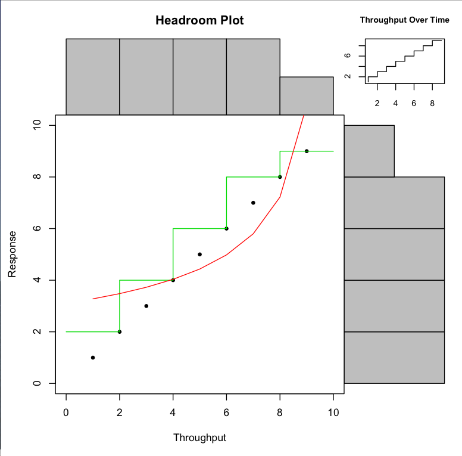

Cockcroft Headroom Plot in R
============================

Code originally written 2006-2008, [documented on my old blog](http://perfcap.blogspot.com/2008/07/enhanced-headroom-plot-in-r.html)

Inspiration from this [CMG/HPTS paper](http://www.hpts.ws/papers/2007/Cockcroft_CMG06-utilization.pdf) and [slide deck](http://www.slideshare.net/adrianco/cmg06-utilization-is-useless) "Utilization is Virtually Useless as a Metric", so what should we use instead? Bottom line: "Utilization is properly defined as busy time
as a proportion of elapsed time. The replacement for utilization is headroom which is defined as the unused proportion of the maximum useful throughput."

To use:
```
> source("chp.r")
```

Definition and options
```
chp <- function(throughput,response, q=0.95, qx=F, xl="Throughput",yl="Response",tl="Throughput Over Time", ml="Headroom Plot", fit=T, max=T, splits=0)

throughput, response: array of values, both must be the same length
q=0.95              : default 95%ile outlier trimming for response time values
qx=F                : default false don't also trim throughput outliers
xl="Throughput"     : default X-axis label
yl="Response"       : default Y-axix label
tl="Throughput..."  : default time series label
ml="Headroom Plot"  : default main plot label
fit=T               : show 1/x fit curve by default
max=T               : show maximum response staircase by default
splits=0            : set this to split the timeseries data into multiple colored sets
```

To test:
```
> chp(1:10,1:10)
```
This will open a plot window showing the following image. It shows a scatterplot of response time as a function of throughput, percentile outliers can be removed from the response time or both metrics. It shows a histogram of throughput distribution oriented outside the X-axis, response time distribution oriented outside the Y-axis, and a small view of sequential throughput over time for the data. The scatterplot is optionally annotated with a staircase showing the maximum value of the response time in each histogram bin, and an attempt is made to fit a throughput weighted inverse (1/x) curve to the data to find the "knee in the curve" for where the response time starts to increase rapidly with throughput.



Github repo created to celebrate #TLAPD2016 Arrrrrrr, R

